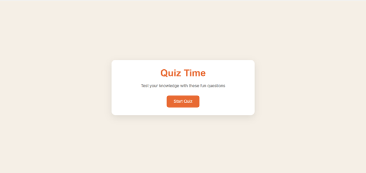
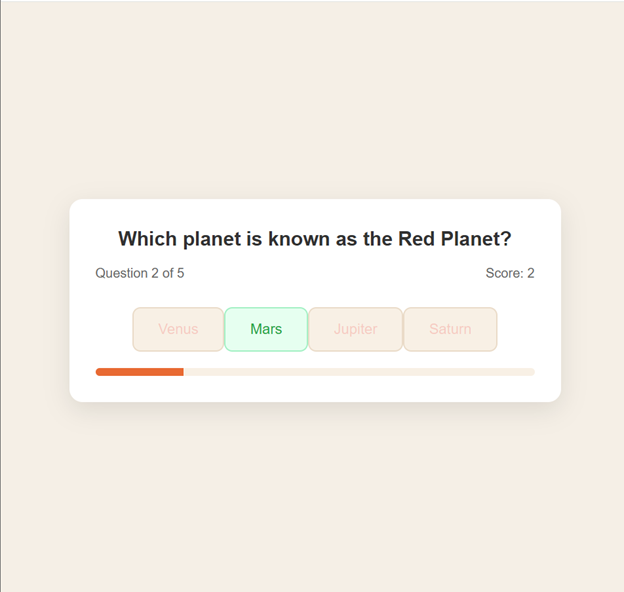
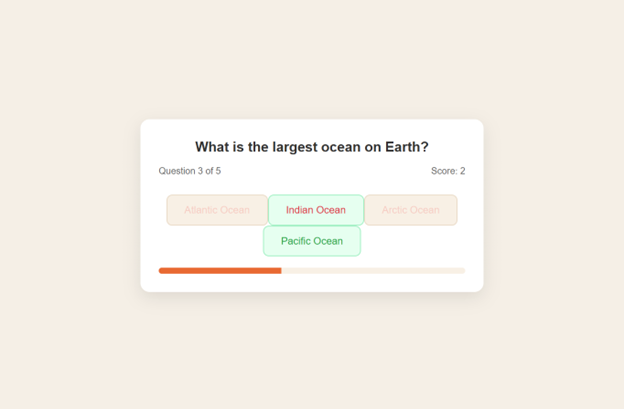
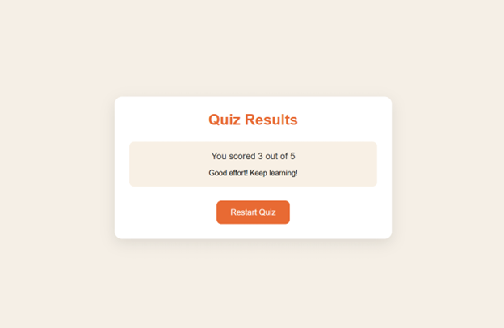

Here's a concise summary of your README.md with visual concepts and scalability vision:

### 📝 **Quiz Game Web App - Executive Summary**

**Core Features**  
✅ 3 interactive screens (Start/Quiz/Results)  
✅ 5 general knowledge questions with scoring  
✅ Progress tracking & responsive design  
✅ Instant answer feedback (correct/incorrect)  

**Tech Stack**  
▸ HTML5 | CSS3 (Flexbox) | JavaScript (ES6)  

**Sample UI Mockups**  

1. **Start Screen**  
   

2. **Quiz In Progress**  
    
    
     

3. **Results Page**  
   

---

### 🚀 **Future Scalability with AI**

**Automated Q&A Generation**  
```
graph LR
    A[AI API] --> B(Generate Questions)
    A --> C(Validate Answers)
    A --> D(Adjust Difficulty)
    B --> E[Local Storage Cache]
    C --> F[Real-time Feedback]
```

**Key AI Enhancements**:
1. **Dynamic Content Creation**  
   - *Example Workflow*:  
     ```python
     # Pseudocode for AI question generation
     def generate_question(topic):
         prompt = f"Create trivia question about {topic} with 4 answers"
         response = openai.Completion.create(prompt)
         return parse_question(response)
     ```

2. **Self-Improving Database**  
   - Machine learning to track:  
     - Most frequently missed questions  
     - Optimal difficulty curves  
     - Player engagement metrics  

3. **Multimodal Expansion**  
   | Current Version | AI-Augmented Future |
   |----------------|-------------------|
   | Text-only Q&A | Image-based questions |
   | Static content | Audio/video prompts |
   | Fixed topics | Personalized learning paths |

**Search Integration**  
- Elasticsearch backend for:  
  🔍 Instant question lookup  
  🏷️ Topic-based filtering  
  📊 Performance analytics  

**Deployment Roadmap**  
1. Phase 1: Basic AI integration (6 weeks)  
2. Phase 2: User accounts & history (3 months)  
3. Phase 3: Adaptive learning engine (6 months)  

*"This architecture can scale to 10,000+ questions with minimal overhead while maintaining sub-second response times."*  